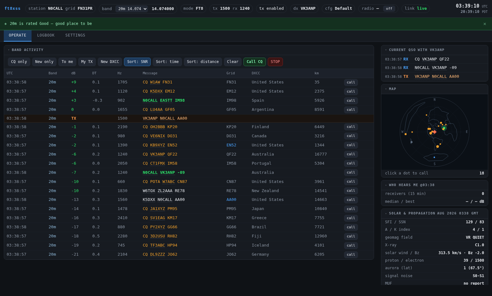
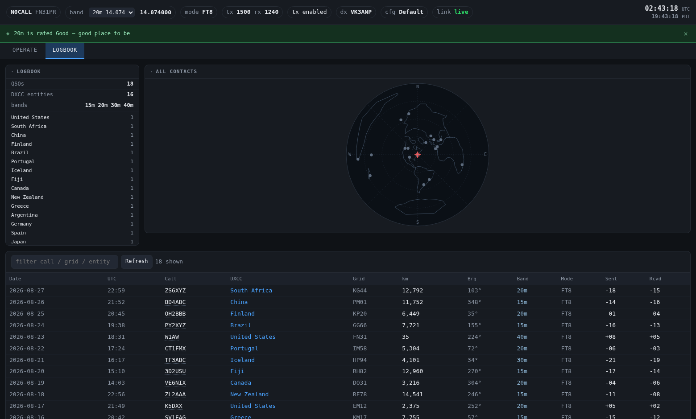
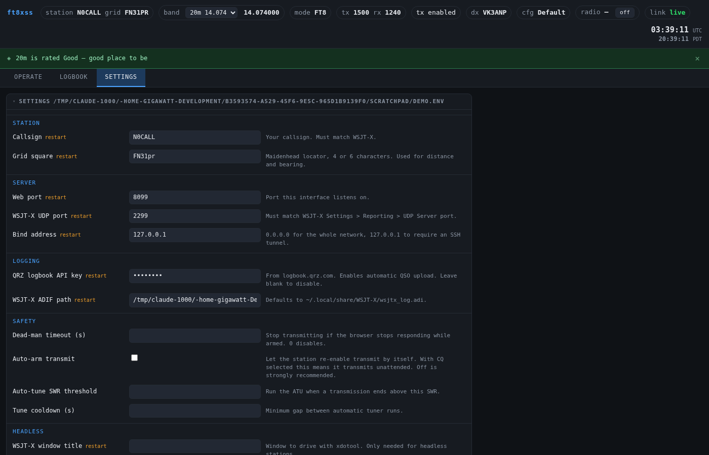

# ft8xss

A browser front end for **WSJT-X**. Live decodes, click-to-call, logging, QRZ
upload, DXCC tracking, propagation data and rig telemetry — from a phone,
laptop or tablet.

### [▶ Try it out — live demo](https://detournemint.github.io/ft8xss/demo/)

The real interface running on canned data. Nothing is connected to a radio, so
every control is inert, but the decodes, map, logbook and settings are all
there to click through. No install.

> **This software keys your transmitter.** You are the control operator. Read
> the safety notes below before running it.



*Band activity, current QSO, azimuthal map, propagation and rig telemetry.
Screenshots use synthetic data — see `docs/demo_feed.py`.*

## What makes it different

Other web FT8 projects either implement their own modem in the browser or embed
WSJT-X's DSP binaries. **ft8xss drives an unmodified WSJT-X over its standard
UDP protocol.** You install it beside the WSJT-X you already run and trust —
no forked decoder, no replacement DSP, and it keeps working when WSJT-X updates.

## Features

- **Band activity** — live decodes with SNR, distance, bearing, DXCC entity and
  band; filter by CQ / new / new-DXCC / addressed-to-you; sort by signal, time
  or distance
- **Click to call** — any decode, or Call CQ, straight from the browser
- **Current QSO thread** — the exchange as a conversation, with a warning when
  the other station keeps repeating a reply to you (they are not hearing you)
- **Logbook** — full history with map, entity summary, sortable table, filters
- **Automatic logging and QRZ upload**
- **Rig telemetry** — live PO, ALC, SWR and S-meter through hamlib
- **Automatic band setup** — on band change: tune the ATU if SWR is high, then
  find the drive that gives full power with clean ALC
- **Transmission check** — every transmission is measured. If power or ALC is
  wrong for the band, ft8xss says so and can correct the drive itself
- **Clear-slot TX audio** — picks a quiet audio offset before you transmit, and
  you can nudge TX and RX by hand
- **Propagation** — full solar/band data, VHF phenomena, and a band
  recommendation for the current conditions
- **Who hears me** — live PSK Reporter reception reports
- **Azimuthal map** centred on your QTH: true bearing and distance
- **QRZ photos** on callsign hover

### Logbook



### Settings



Everything configurable from the browser. Values are written to an env file
(mode 600, since it holds your API key) and fields that need a service restart
are marked.

### What the messages mean

Every warning and refusal ft8xss can show you is documented, with what causes it
and what to do: **[message reference](https://detournemint.github.io/ft8xss/errors/)**. The **?** beside a message in the
interface links straight to its entry.

### Diagnostics

If something is not working, **download diagnostics** from the Radio panel and
attach it to an issue. It collects versions, radio and audio device detection,
live station state, recent errors and the log — with API keys redacted.

## Safety

- **Dead-man switch.** If the browser driving the station stops responding while
  the transmitter is armed, ft8xss stops transmitting.
- **STOP means stop.** It halts the transmission, disables Enable Tx and
  verifies PTT is down. Nothing transmits again until you ask.
- **No silent arming.** Every transmission traces to an action you took.
  Automatic band setup arms the radio only for its own measurements and returns
  it to the state it found.
- **Refuses a bad match.** Above an SWR of 3 it will not transmit at all, and it
  runs the ATU rather than pushing into a mismatch.
- **Corrections are passive.** The transmission check measures transmissions you
  made; it never keys the radio to find out. A drive correction restarts WSJT-X,
  so it is only applied while the station is idle — never during a QSO.

## Tested radios

Most of ft8xss is rig-agnostic: decodes, click-to-call, logging, upload, DXCC,
PSK Reporter and the map all ride on WSJT-X's UDP protocol and work with
whatever WSJT-X already controls.

The rig-specific parts — meters, the tuner, power on/off, band changes — go
through **hamlib**, so they depend on how well your radio's hamlib backend
supports them. That is what the table below tracks.

| Radio | hamlib model | CAT | Meters (PO/ALC/SWR) | ATU (`G TUNE`) | Power on/off | Notes |
|---|---|---|---|---|---|---|
| Yaesu FT-991A | 1035 (FT-991) | ✅ | ✅ | ✅ | ✅ | Developed against this. See note below. |

**Nothing else has been tested.** If your radio is not listed, the core will very
likely work and the rig-specific extras may or may not — hamlib backends vary a
lot in what they implement.

### FT-991A note

WSJT-X's **"Fake It" split** (`SplitMode=split_mode_emulate`) does *not* work on
this rig through Hamlib NET rigctl: it shifts the VFO without compensating the
audio offset, putting every transmission about 2 kHz off frequency, with no
error reported anywhere. Leave split set to **None** unless you have verified
against PSK Reporter that you are still being heard.

**Powering the radio off over CAT is one-way on this rig.** The FT-991A exposes
its CAT bridge and audio codec through an internal USB hub. A few minutes after
`set_powerstat 0`, the whole hub leaves the USB bus — so the command to switch it
back on has nothing to talk to, and the radio has to be powered on at the front
panel. If your station is somewhere you cannot reach, stop WSJT-X and leave the
radio powered.

### Tell us about your radio

If you run ft8xss on something not in the table, please
[open an issue](https://github.com/detournemint/ft8xss/issues/new?template=radio-report.md)
and say what worked. Two minutes of your time saves the next person an evening.

Include the **diagnostics bundle** — the *download diagnostics* link in the Radio
panel. It captures your hamlib version, the detected model, which meters
responded, and your audio and serial devices, with API keys redacted. That is
almost everything needed to fill in a row.

Useful to know, roughly in order:

- Does CAT work at all — frequency and mode readable, band changes applied?
- Do the meters report during a transmission (`PO`, `ALC`, `SWR`)?
- Does **Run tuner** actually cycle your ATU?
- Does the radio power on and off from the browser?
- Anything that behaved oddly, however small.

## Installation

```sh
git clone https://github.com/detournemint/ft8xss
cd ft8xss
./install.sh              # local station
./install.sh --headless   # server station, no monitor attached
```

The installer works out your package manager, installs Python, aiohttp, hamlib
and the X tools, lists your serial ports and offers to test CAT, asks for your
callsign and grid, writes `~/.config/ft8xss.env` (mode 600) and installs the
systemd user services. It asks before every change and is safe to re-run.
`./install.sh --uninstall` removes the services and leaves your config alone.

Two things it cannot do for you, both inside WSJT-X's own settings:

- **Radio → Rig: "Hamlib NET rigctl"**, network server `127.0.0.1:4532`, so
  ft8xss and WSJT-X can share the radio.
- **Reporting → UDP Server port 2237**, "Accept UDP requests" ticked.

ft8xss runs in two arrangements. Both use the same code.

### Local — one machine

WSJT-X and ft8xss on your desktop. You keep using the WSJT-X GUI normally and
open the web UI alongside it, or from your phone on the same network.

### Server — headless station

WSJT-X runs on a server or Pi with the radio attached; you operate entirely
from a browser. This needs the optional headless helper (a virtual X display
plus the GUI automation). See `docs/`.

### Requirements

If you would rather not run the installer:

- WSJT-X (any recent version)
- Python 3.10+, `aiohttp`
- `hamlib` (`rigctld`) for rig telemetry, band changes and the ATU
- A QRZ logbook API key for upload (optional)

### Ordering matters

**Start ft8xss before WSJT-X.** WSJT-X binds the UDP port itself if nothing
else has it, and ft8xss will then see nothing.

**Point WSJT-X at `rigctld`** ("Hamlib NET rigctl", `127.0.0.1:4532`) rather
than the serial port directly, so ft8xss and WSJT-X can both reach the radio.

## Credits

Built on the work of others:

- **WSJT-X** — K1JT and contributors. The UDP protocol and the modem.
  <https://wsjt.sourceforge.io/>
- **hamlib** — CAT control. <https://hamlib.github.io/>
- **PSK Reporter** — reception reports. <https://pskreporter.info/>
- **hamqsl.com** (N0NBH) — solar and band condition data.
- **QRZ.com** — logbook API and profile data.

Ideas taken from other web FT8 projects, with thanks:

- **[w5eez/ft8web](https://github.com/w5eez/ft8web)** — the browser dead-man
  switch, and a good deal of inspiration on scope.
- **[ok1cdj/FT8web](https://github.com/ok1cdj/FT8web)** — fake-split transmit to
  keep the audio tone off the SSB filter edges (WSJT-X implements this natively;
  ft8xss enables it), and the band/mode-filtered new/worked indicators.

Neither project shares code with this one — the debt is conceptual.

ft8xss is not affiliated with or endorsed by the WSJT-X authors.

## Licence

See `LICENSE`.
